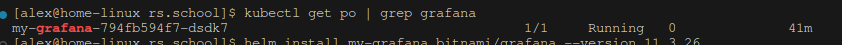

This repository is configured for deploying Prometheus and Grafana on a K3s cluster.  
Additionally, the Blackbox Exporter operator is installed. You can find more information about it here: [Blackbox Exporter GitHub Repository](https://github.com/prometheus/blackbox_exporter).

### Deployment Instructions

To deploy Prometheus and Grafana, you need to run the `terraform apply` command. This will:  
1. Provision the resources defined in `aws-devops-provision/provision.tf`.  
2. Execute the script `aws-devops-provision/data/bootstrap-k3s.sh` to set up the environment.  

---
To create a Grafana dashboard with basic metrics (e.g., CPU, memory, and storage utilization) using Prometheus as the data source, follow these steps:

---

### ** 1: Configure Prometheus as a Data Source in Grafana**
1. **Log in to Grafana:**
   - Open your Grafana instance in a browser and log in.
   
2. **Add Prometheus Data Source:**
   - Navigate to **Settings** → **Data Sources**.
   - Click **Add data source**.
   - Select **Prometheus** from the list.
   - Enter the Prometheus URL (e.g., `http://<PROMETHEUS_SERVER>:9090`).
   - Save & test the data source.

---

### ** 2: Create a New Dashboard**
1. **Start a New Dashboard:**
   - Go to the **Dashboards** menu and click **New Dashboard**.
   - Select **Add a new panel**.

2. **Configure Panels for Metrics:**
   - For each panel, enter the relevant PromQL query in the **Query** section.

---

### ** 3: Add Metrics Panels**
Here are some common PromQL queries for metrics visualization:

#### **CPU Utilization**
- **Query**:
  ```promql
  100 - (avg by (instance) (rate(node_cpu_seconds_total{mode="idle"}[5m])) * 100)
  ```
- **Panel Suggestions**:
  - Gauge or Time-series chart.
  - Set thresholds for high CPU usage.

---

#### **Memory Usage**
- **Query**:
  ```promql
  100 * (1 - (node_memory_MemAvailable_bytes / node_memory_MemTotal_bytes))
  ```
- **Panel Suggestions**:
  - Gauge or Time-series chart.
  - Display usage percentage.

---

#### **Storage Usage**
- **Query**:
  ```promql
  100 * (node_filesystem_size_bytes{mountpoint="/"} - node_filesystem_avail_bytes{mountpoint="/"}) / node_filesystem_size_bytes{mountpoint="/"}
  ```
- **Panel Suggestions**:
  - Bar or Time-series chart for storage utilization per disk.
  - Display individual disks if needed.

---

### ** 4: Customize Panels**
1. **Set Titles and Descriptions:**
   - Edit panel titles to reflect the metric (e.g., *CPU Usage*, *Memory Usage*).

2. **Adjust Visualization:**
   - Choose a visualization type (Gauge, Time series, Table, etc.).
   - Apply color thresholds (e.g., green for normal, red for high usage).

3. **Fine-tune Options:**
   - Configure refresh rate for real-time data (e.g., 5s or 10s).
   - Set the time range for the data displayed.

---

### ** 5: Save the Dashboard**
1. Click **Save Dashboard**.
2. Give it a name (e.g., *System Metrics Dashboard*).
3. Optionally, share it with other users or teams.


---

## Submission

- Provide a PR with automation of a Grafana deployment in Kubernetes with IaC or CI/CD pipeline.
Done

- Provide an output of `kubectl get pods` with running Grafana.


- Include a screenshot or configuration of the Prometheus data source configuration.

<details>
  <summary>Full screenshot</summary>

 
	
</details>

- Include a screenshot of the dashboard created.


- Include a JSON file of the dashboard layout.
[JSON file](dashboard.json)

- Provide a README file documenting the Grafana deployment and configuration.
Done


## Evaluation Criteria (100 points for covering all criteria)

1. **Grafana Installation (30 points)**
   - Grafana is installed on the K8s cluster using the Helm chart by Bitnami.

   - A data source pointing to the existing Prometheus installation is added.


2. **Dashboard Creation (40 points)**
   - A dashboard is created with basic metrics visualized, such as CPU and memory utilization, storage usage, etc.
			


3. **Deployment Automation (10 points)**
   - Automation of deployment with IaC or CI/CD pipeline is created.
[Deployment Automation](data/bootstrap-k3s.sh)

4. **Additional Tasks (20 points)**
   - Admin user password is created with a separate secret. (10 points)

   - A JSON file of the dashboard layout is provided. (5 points)
[JSON file of the dashboard](dashboard.json)
   - The Grafana setup, including the dashboard creation, is documented in a README file. (5 points)